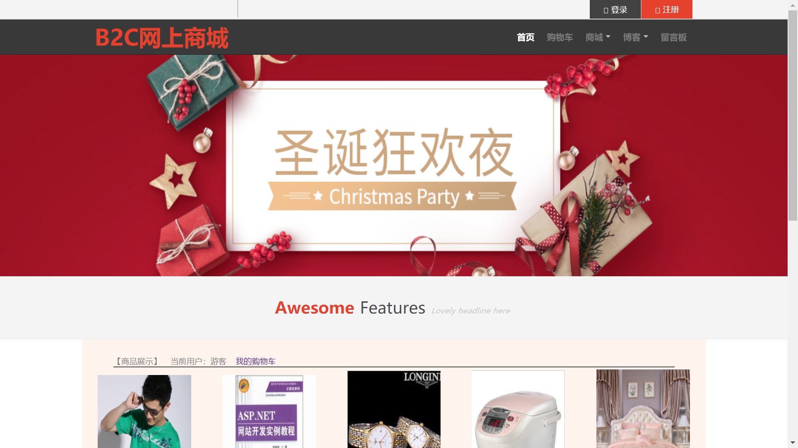
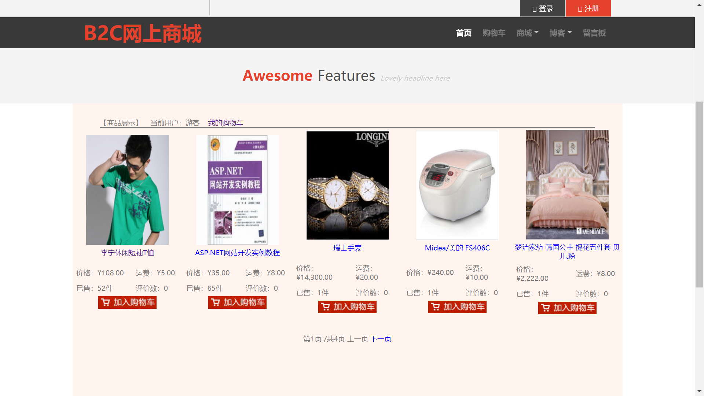
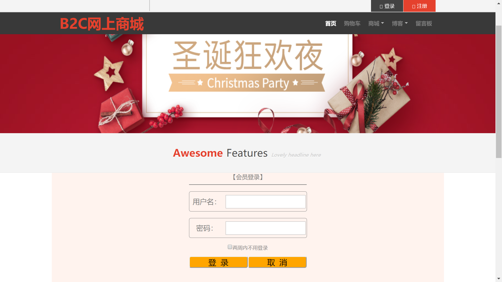
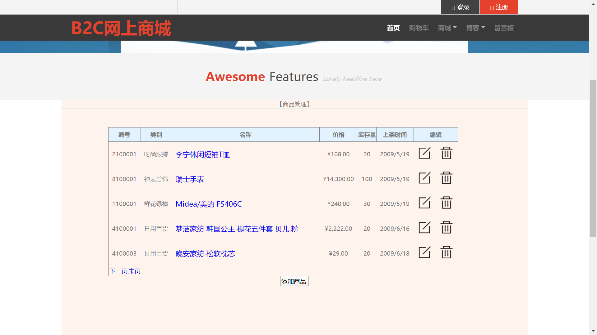

# ShoppingCity

B2C网上商城

![asp][asp]
![GPL License][license-shield]


<p align="center">
    
  </a>


  <h3 align="center"> B2C网上商城</h3>
  <p align="center">
    B2C网上商城，asp.net的一个实训’赶工(垃圾)‘项目，脱敏开源，只为备份
  </p>

## 目录

- [效果](#效果)
- [文件目录说明](#文件目录说明)
- [部署](#部署)
- [使用到的](#使用到的)
- [版本控制](#版本控制)

### 效果

1. 
2. 
3. 
4. 
5. 
6. 赶工（垃圾）项目，bug多多，仅供参考
### 文件目录

```shell
filetree 
├── DB
│   ├── SMDB_log.ldf
│   └── SMDB.mdf
├── packages
│   ├── AlipaySDKNet.4.1.38
│   │   ├── AlipaySDKNet.4.1.38.nupkg
│   │   └── lib
│   │       └── net35
│   │           └── AlipaySDKNet.dll
│   ├── BouncyCastle.1.8.5
│   │   ├── BouncyCastle.1.8.5.nupkg
│   │   ├── lib
│   │   │   └── BouncyCastle.Crypto.dll
│   │   └── README.md
│   ├── Newtonsoft.Json.12.0.2
│   │   ├── lib
│   │   ├── LICENSE.md
│   │   └── Newtonsoft.Json.12.0.2.nupkg
│   └── repositories.config
├── README.assets
├── README.md
├── ShoppingCity
│   ├── AdminsManager
│   │   ├── AdminAdd.aspx
│   │   ├── AdminAdd.aspx.cs
│   │   ├── AdminAdd.aspx.designer.cs
│   │   ├── AdminIndex.aspx
│   │   ├── AdminIndex.aspx.cs
│   │   ├── AdminIndex.aspx.designer.cs
│   │   ├── AdminLogin.aspx
│   │   ├── AdminLogin.aspx.cs
│   │   ├── AdminLogin.aspx.designer.cs
│   │   ├── AdminsManager.aspx
│   │   ├── AdminsManager.aspx.cs
│   │   ├── AdminsManager.aspx.designer.cs
│   │   ├── EditAdmin.aspx
│   │   ├── EditAdmin.aspx.cs
│   │   └── EditAdmin.aspx.designer.cs
│   ├── App_Themes
│   │   └── default
│   │       └── css.css
│   ├── BBS.dbml
│   ├── BBS.dbml.layout
│   ├── BBS.designer.cs
│   ├── css
│   │   ├── font-awesome.min.css
│   │   ├── glyphicons.css
│   │   ├── index.css
│   │   ├── login.css
│   │   └── style.css
│   ├── Default.Master
│   ├── Default.Master.cs
│   ├── Default.Master.designer.cs
│   ├── GoodsManager
│   │   ├── AddGoods.aspx
│   │   ├── AddGoods.aspx.cs
│   │   ├── AddGoods.aspx.designer.cs
│   │   ├── EditGoods.aspx
│   │   ├── EditGoods.aspx.cs
│   │   ├── EditGoods.aspx.designer.cs
│   │   ├── GoodsDetail.aspx
│   │   ├── GoodsDetail.aspx.cs
│   │   ├── GoodsDetail.aspx.designer.cs
│   │   ├── GoodsList.aspx
│   │   ├── GoodsList.aspx.cs
│   │   ├── GoodsList.aspx.designer.cs
│   │   ├── GoodsManage.aspx
│   │   ├── GoodsManage.aspx.cs
│   │   ├── GoodsManage.aspx.designer.cs
│   │   ├── GoodsType.dbml
│   │   ├── GoodsType.dbml.layout
│   │   ├── GoodsType.designer.cs
│   │   ├── GoodsTypeManage.aspx
│   │   ├── GoodsTypeManage.aspx.cs
│   │   └── GoodsTypeManage.aspx.designer.cs
│   ├── images
│   ├── JS
│   │   ├── jquery-3.4.1.min.js
│   │   ├── menus.js
│   │   └── pictures.js
│   ├── MessageManage
│   │   ├── BBSAnswerList.aspx
│   │   ├── BBSAnswerList.aspx.cs
│   │   ├── BBSAnswerList.aspx.designer.cs
│   │   ├── BBSNoteList.aspx
│   │   ├── BBSNoteList.aspx.cs
│   │   └── BBSNoteList.aspx.designer.cs
│   ├── packages.config
│   ├── Pay
│   │   ├── AliPay.aspx
│   │   ├── AliPay.aspx.cs
│   │   ├── AliPay.aspx.designer.cs
│   │   ├── App_Code
│   │   │   └── config.cs             //支付宝沙箱配置相关
│   │   ├── Return_url.aspx
│   │   └── Return_url.aspx.cs
│   ├── Properties
│   │   ├── AssemblyInfo.cs
│   │   └── PublishProfiles
│   │       └── FolderProfile.pubxml
│   ├── ShoppingCarManage.aspx
│   ├── ShoppingCarManage.aspx.cs
│   ├── ShoppingCarManage.aspx.designer.cs
│   ├── ShoppingCity.csproj
│   ├── SQLHelper.cs
│   ├── UserManager
│   │   ├── UserLogin.aspx
│   │   ├── UserLogin.aspx.cs
│   │   ├── UserLogin.aspx.designer.cs
│   │   ├── UserRegister.aspx
│   │   ├── UserRegister.aspx.cs
│   │   ├── UserRegister.aspx.designer.cs
│   │   ├── Users.dbml
│   │   ├── Users.dbml.layout
│   │   ├── Users.designer.cs
│   │   ├── UsersManager.aspx
│   │   ├── UsersManager.aspx.cs
│   │   ├── UsersManager.aspx.designer.cs
│   │   └── xe2b0ghe.qiv
│   ├── VCode.aspx
│   ├── VCode.aspx.cs
│   ├── VCode.aspx.designer.cs
│   ├── Web.config               //你的数据库链接字符串
│   ├── Web.Debug.config
│   └── Web.Release.config
└── ShoppingCity.sln

```


### 部署

暂无

### 使用到的

- *VS* 2019
- *SQL* Server
- [支付宝沙箱环境](https://docs.open.alipay.com/200/105311)

### 版本控制

该项目使用Git进行版本管理。您可以在repository参看当前可用版本。

### 版权说明

该项目使用GNU General Public License v3.0 授权许可，详情请参阅 [LICENSE.txt](https://github.com/izzp/ShoppingCity/blob/master/LICENSE)

<!-- links -->

[asp]: https://img.shields.io/badge/language-ASP-orange.svg?style=flat-square
[license-shield]: https://img.shields.io/github/license/izzp/ShoppingCity.svg?style=flat-square
[license-url]: https://github.com/izzp/ShoppingCity/blob/master/LICENSE


